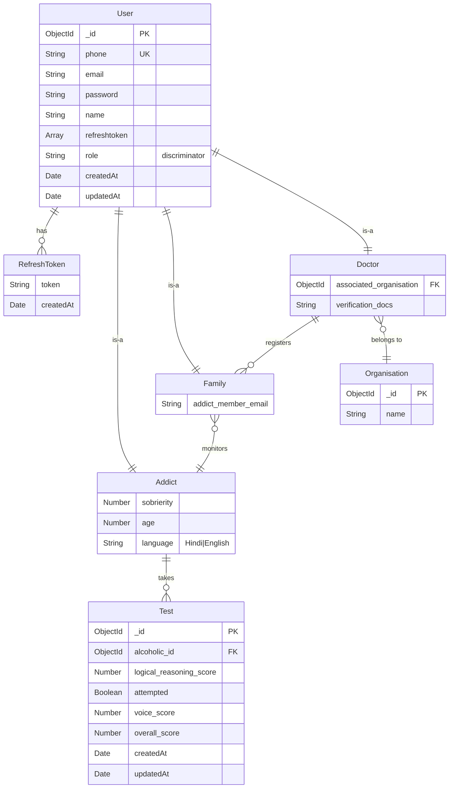

# Backend API Documentation

## Overview

This is a Node.js/Express backend for an **Alcohol Addiction Monitoring and Testing System**. The system provides cognitive testing capabilities for alcohol addiction recovery, family member management, and real-time communication features.

## System Architecture

### Technology Stack
- **Runtime**: Node.js
- **Framework**: Express.js
- **Database**: MongoDB with Mongoose ODM
- **Authentication**: JWT (Access & Refresh tokens)
- **Real-time Communication**: Socket.IO
- **AI Integration**: Google Gemini AI for test generation
- **ML Processing**: Xenova Transformers for answer scoring
- **Security**: Helmet, bcrypt for password hashing

### Core Features
1. **User Management** - Multi-role user system (Addicts, Family, Doctors)
2. **Cognitive Testing** - AI-generated sobriety tests with ML-based scoring
3. **Family Monitoring** - Family members can monitor addicts' progress
4. **Real-time Communication** - Socket-based calling system
5. **Authentication & Authorization** - JWT-based secure access

## Database Schema & ER Diagram

### Entity Relationship Diagram



### Data Models

#### 1. User (Base Schema)
```javascript
{
  phone: String (required, unique, indexed),
  email: String (required),
  password: String (required, hashed),
  name: String (required),
  refreshtoken: [{
    token: String (required),
    createdAt: Date (default: now)
  }],
  role: String (discriminator key)
}
```

#### 2. Addict (User Discriminator)
```javascript
{
  sobrierity: Number (required),
  age: Number (required),
  language: String (enum: ['Hindi', 'English'], default: 'Hindi')
}
```

#### 3. Family (User Discriminator)
```javascript
{
  addict_member_email: String (required)
}
```

#### 4. Doctor (User Discriminator)
```javascript
{
  associated_organisation: ObjectId (ref: 'Organisation'),
  verification_docs: String (required, URL)
}
```

#### 5. Test
```javascript
{
  alcoholic_id: ObjectId (ref: "Alcohol"),
  logical_reasoning_score: Number (default: 0),
  attempted: Boolean (default: false),
  voice_score: Number (default: 0),
  overall_score: Number (default: 0)
}
```

## API Endpoints

### Authentication Routes (`/`)

#### POST `/login`
**Purpose**: Authenticate users and generate access tokens

**Request Body**:
```json
{
  "phone": "string",
  "email": "string", 
  "password": "string"
}
```

**Response**:
```json
{
  "status": true,
  "accesstoken": "jwt_token",
  "userData": {
    // User object without sensitive data
  }
}
```

**Error Responses**:
- `404`: User not found
- `401`: Invalid password
- `500`: Internal server error

### Test Routes (`/test`)

#### POST `/test/request`
**Purpose**: Request a new cognitive test for an addict

**Request Body**:
```json
{
  "phone": "string"
}
```

**Response**:
```json
{
  "status": true,
  "test": {
    "_id": "test_id",
    "alcoholic_id": "user_id",
    "attempted": false,
    // ... other test fields
  }
}
```

#### POST `/test/questions`
**Purpose**: Get AI-generated test questions

**Request Body**:
```json
{
  "id": "user_id"
}
```

**Response**:
```json
{
  "status": true,
  "test": {
    "questions": [
      {
        "id": 1,
        "text": "Question text",
        "type": "attention|registration|recall|other_cognitive",
        "expected_answer": "expected response"
      }
      // ... 4 more questions
    ]
  }
}
```

**Business Rules**:
- Test must be requested within 30 minutes
- Generates exactly 5 questions using Gemini AI
- Questions focus on attention, concentration, and memory

#### POST `/test/submit`
**Purpose**: Submit answer for a test question

**Request Body**:
```json
{
  "answer": "user_response",
  "question": {
    // Question object from /questions endpoint
  },
  "id": "user_id"
}
```

**Response**:
```json
{
  "status": true,
  "nanswer": {
    "score": 2,
    "max": 3,
    "similarity": 0.85
  }
}
```

**Scoring Algorithm**:
- Uses ML-based semantic similarity (Xenova transformers)
- Different scoring thresholds based on question type:
  - **Registration/Recall**: 0-3 points (similarity thresholds: 0.70, 0.50, 0.30)
  - **Attention**: 0-2 or 0-3 points depending on complexity
  - **Other Cognitive**: 0-1 points

#### POST `/test/store`
**Purpose**: Mark test as completed

**Request Body**:
```json
{
  "id": "user_id"
}
```

**Response**:
```json
{
  "status": true,
  "test": {
    // Complete test object with attempted: true
  }
}
```

## Core Business Logic

### 1. Cognitive Testing System

**Test Generation Process**:
1. Family member or system requests test for addict
2. AI (Gemini) generates 5 cognitive questions focusing on:
   - Attention/Concentration (serial subtraction, backwards counting)
   - Memory (word registration and recall)
   - Other cognitive tasks (arithmetic, sentence repetition)
3. Questions are dynamically varied to prevent memorization

**Answer Scoring Process**:
1. User submits text/voice answer
2. Answer is normalized (lowercase, punctuation removed)
3. ML model generates embeddings for user answer and expected answer
4. Cosine similarity calculated between embeddings
5. Score assigned based on question type and similarity threshold

### 2. User Role System

**Addict**:
- Takes cognitive tests
- Receives calls from family members
- Has sobriety tracking and language preferences

**Family**:
- Monitors specific addict member
- Can request calls to addict
- Registered by doctors

**Doctor**:
- Registers family members
- Associated with organizations
- Requires verification documents

### 3. Real-time Communication

**Call System**:
- Family members can request calls to addicts
- Uses Socket.IO for real-time communication
- Integrates with external calling API (placeholder implemented)

## Security Features

### Authentication
- **JWT Access Tokens**: 15-minute expiry
- **JWT Refresh Tokens**: 15-day expiry, stored in database
- **Password Hashing**: bcrypt with salt rounds
- **Phone Number Indexing**: Unique constraint for user identification

### Security Middleware
- **Helmet**: Security headers
- **Request Size Limiting**: 10kb JSON payload limit
- **CORS**: Configured for Socket.IO
- **Environment Variables**: Sensitive data in .env file

## Configuration

### Environment Variables
```env
MONGO_URI=mongodb+srv://...
ACCESS_TOKEN=secret_key_for_access_tokens
REFRESH_ACCESS_TOKEN=secret_key_for_refresh_tokens
GEMINI_API_KEY=google_gemini_api_key
```

### Database Connection
- MongoDB Atlas connection
- Automatic index synchronization
- Connection error handling with process exit

## Socket.IO Integration

### Real-time Features
- **Connection Management**: Track user socket connections
- **Call Notifications**: Emit incoming call events to addicts
- **Ping Configuration**: 60s timeout, 25s interval

### Socket Events
- `connection`: New client connection
- `incoming_call`: Notify addict of family call request

## Error Handling

### Standardized Error Responses
```json
{
  "success": false,
  "message": "Error description"
}
```

### Common Error Codes
- **400**: Bad Request (missing fields)
- **401**: Unauthorized (invalid credentials, expired tokens)
- **404**: Not Found (user, test not found)
- **500**: Internal Server Error

## AI/ML Integration

### Google Gemini AI
- **Purpose**: Generate cognitive test questions
- **Model**: gemini-2.5-flash
- **Output**: Structured JSON with 5 questions
- **Question Types**: Attention, memory, cognitive tasks

### Xenova Transformers
- **Purpose**: Score user answers using semantic similarity
- **Model**: all-MiniLM-L6-v2
- **Process**: Feature extraction → cosine similarity → threshold-based scoring

## Performance Considerations

### Database Optimization
- Indexed phone numbers for fast user lookup
- Discriminator pattern for user roles (single collection)
- Timestamp-based test sorting for recent results

### Caching Strategy
- ML model loaded once and reused
- Connection pooling for MongoDB

### Rate Limiting
- 30-minute window for test requests
- Prevents test abuse and ensures meaningful intervals

## Development Notes

### Code Issues Identified
1. **Socket.IO Bug**: `return socket;` should be `return socket_;` in `initSockets`
2. **Import Error**: `family.controller.js` has wrong import path
3. **Missing Exports**: `Doctor` model not exported
4. **Incomplete Features**: Call system has placeholder API integration

### Recommended Improvements
1. Add input validation middleware
2. Implement proper error logging
3. Add API rate limiting
4. Complete socket.io call system integration
5. Add comprehensive test coverage
6. Implement API documentation (Swagger/OpenAPI)

## Usage Examples

### Complete Test Flow
```javascript
// 1. Request test
POST /test/request { "phone": "1234567890" }

// 2. Get questions (within 30 minutes)
POST /test/questions { "id": "user_id" }

// 3. Submit answers (repeat for each question)
POST /test/submit { 
  "id": "user_id",
  "question": {...},
  "answer": "user response"
}

// 4. Complete test
POST /test/store { "id": "user_id" }
```

### Authentication Flow
```javascript
// Login
POST /login {
  "phone": "1234567890",
  "email": "user@example.com", 
  "password": "password123"
}

// Use access token in subsequent requests
Authorization: Bearer <access_token>
```

This backend provides a comprehensive system for alcohol addiction monitoring with AI-powered cognitive testing, family support features, and real-time communication capabilities.